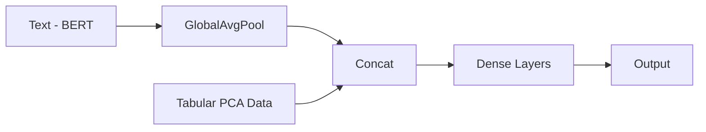

# 🌱 Evergreen Content Classification with Multimodal BERT

This project implements a **Multimodal BERT Text Classifier** to determine whether a web article is **Evergreen** or **Non-Evergreen** by integrating **textual embeddings** from BERT with **engineered numerical features**. The model is designed and trained using **TensorFlow**, achieving improved classification performance through a hybrid architecture.

---

## 📌 Problem Statement

Given a dataset of web articles with structured metadata and unstructured text (`boilerplate`), the goal is to predict whether the content is evergreen — meaning it remains relevant over time or not.

---

## 🔍 Dataset

- **Source**: [Kaggle - StumbleUpon Evergreen Classification](https://www.kaggle.com/c/stumbleupon)
- `train.tsv` - 7395 entries with 27 features  
- `test.tsv` - 3171 entries with 26 features  
- Features include:
  - Structured attributes (e.g., `linkwordscore`, `spelling_errors_ratio`)
  - Categorical metadata (e.g., `alchemy_category`)
  - Unstructured text data (`boilerplate`)

---

## 🧪 Preprocessing

### 🔢 Numerical Features
- Dropped low-variance columns like `framebased`, `hasDomainLink`, etc.
- One-hot encoded features: `alchemy_category`, `lengthyLinkDomain`
- Normalized features using **MinMaxScaler**
- Reduced dimensionality via **PCA (6 components)**

### 📝 Text Features
- Extracted text from `boilerplate` JSON fields
- Cleaned and tokenized using `bert-base-uncased` tokenizer
- Input sequences capped at 512 tokens

---

## 🧠 Model Architecture

### 🔗 **Multimodal BERT Classifier**

#### Combines:
- **BERT-based embeddings** for textual data
- **Dense network layers** for numerical features (after PCA)

